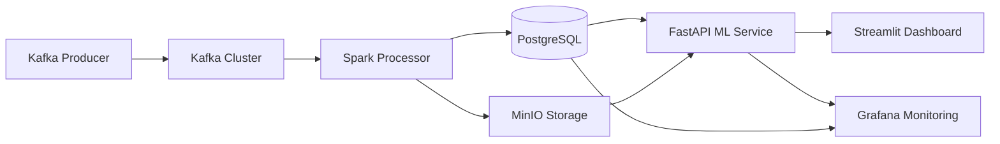

# 🚀 Nitro Project - Industrial Predictive Monitoring System

## 📋 Table of Contents
1. [Features](#-features)
2. [System Architecture](#-system-architecture)
3. [Services and Ports](#-services-and-ports)
4. [Quick Start](#-quick-start)
5. [Project Structure](#-project-structure)
6. [Analysis Notebooks](#-analysis-notebooks)
7. [Data Flow](#-data-flow)
8. [Implemented Technologies](#-implemented-technologies)
9. [Maintenance](#-maintenance)
10. [Troubleshooting](#-troubleshooting)

## ✨ Features

- 📊 **Real-time data ingestion** with Kafka Producer
- ⚡ **Distributed processing** with Spark Streaming
- 🔧 **Intelligent orchestration** with Apache Airflow
- 💾 **Scalable storage** in PostgreSQL and MinIO
- 🤖 **Advanced MLOps** with MLflow and SHAP
- 📈 **Professional visualization** with Streamlit and Grafana
- 📓 **Comprehensive analysis** with specialized notebooks
- 🔍 **Real-time monitoring** with interactive dashboards

## 🏗️ System Architecture



## 🌐 Services and Ports

| Service | URL | Port | Credentials | Status |
|----------|-----|--------|--------------|--------|
| 🔧 **Airflow** | http://localhost:8080 | 8080 | admin/admin | ✅ Operational |
| ⚡ **Spark Master** | http://localhost:8081 | 8081 | - | ✅ Operational |
| 📊 **Streamlit Dashboard** | http://localhost:8501 | 8501 | - | ✅ Operational |
| 📈 **Grafana** | http://localhost:3000 | 3000 | admin/admin123 | ✅ Operational |
| 💾 **MinIO Console** | http://localhost:9001 | 9001 | admin/admin12345 | ✅ Operational |
| 🗄️ **PostgreSQL** | localhost:5432 | 5432 | nitro_user/nitro_pass | ✅ Operational |
| 🚀 **FastAPI** | http://localhost:8000 | 8000 | - | ✅ Operational |
| 📡 **Kafka** | localhost:9092 | 9092/29092 | - | ✅ Operational |

## 🚀 Quick Start

```bash
# Clone the repository
git clone <your-repository>
cd proyecto-nitro

# Start all services
docker-compose up -d

# Check service status
docker-compose ps

# Start the data producer
./start-producer.sh

# Access dashboards (wait 2-3 minutes for complete initialization)
echo "Access URLs:"
echo "Airflow: http://localhost:8080"
echo "Grafana: http://localhost:3000"
echo "Streamlit: http://localhost:8501"
```

## 📁 Project Structure

```
proyecto-nitro/
├── 📊 airflow/                 # Airflow DAGs and configuration
├── 🚀 api-dashboard/           # FastAPI and Streamlit
│   ├── fastapi/               # ML prediction API
│   └── dashboards/            # Interactive dashboards
├── 📡 kafka-producer/          # Kafka data producer
│   ├── Dockerfile
│   ├── kafka_producer.py
│   └── requirements.txt
├── 🗄️ minio-setup/             # MinIO bucket configuration
├── 📓 notebooks/              # Analysis and modeling
│   ├── 📊 EDA.ipynb
│   ├── ⚙️ feature_engineering.ipynb
│   ├── 🤖 model_training.ipynb
│   ├── 🔍 mlflow_tracking.ipynb
│   ├── 📈 SHAP_analysis.ipynb
│   ├── 📋 reports/
│   ├── 🧠 models/
│   └── 💾 data/
│       └── enhanced_predictions.csv
├── 🗃️ postgres-setup/          # PostgreSQL schemas and config
├── ⚡ python-processor/        # Spark data processor
├── 🔥 spark-processing/       # Spark jobs
├── 🐳 docker-compose.yml      # Container orchestration
├── 🚀 start-producer.sh       # Startup script
└── 📖 README.md              # This file
```

## 📓 Analysis Notebooks

| Notebook | Description | Technologies |
|----------|-------------|-------------|
| 📊 `EDA.ipynb` | Exploratory Data Analysis | Pandas, Matplotlib, Seaborn |
| ⚙️ `feature_engineering.ipynb` | Feature engineering | Scikit-learn, Featuretools |
| 🤖 `model_training.ipynb` | Predictive model training | Scikit-learn, XGBoost, MLflow |
| 🔍 `mlflow_tracking.ipynb` | ML experiment tracking | MLflow, Hyperopt |
| 📈 `SHAP_analysis.ipynb` | Model explainability | SHAP, Matplotlib |

## 🔄 Data Flow

1. **Ingestion**: Kafka Producer generates simulated industrial sensor data
2. **Streaming**: Kafka publishes to `sensor_topic` with 1 partition
3. **Processing**: Spark processes data in real-time with transformations
4. **Storage**: Data persisted in PostgreSQL (structured) and MinIO (raw)
5. **Analysis**: Specialized notebooks for EDA and predictive modeling
6. **Visualization**: Real-time dashboards with Streamlit and Grafana
7. **Prediction**: FastAPI serves ML models for predictive maintenance

## 🛠️ Implemented Technologies

### 🏗️ Data Engineering


### 🤖 Machine Learning


### 📊 Visualization & Monitoring


### 🐳 Infrastructure


## 🛠️ Maintenance

### Useful Commands
```bash
# View logs for all services
docker-compose logs

# View specific service logs
docker-compose logs kafka
docker-compose logs spark-master

# Restart a specific service
docker-compose restart kafka-producer

# Check container status
docker-compose ps

# Access PostgreSQL
docker-compose exec postgres psql -U nitro_user -d nitro_db

# List Kafka topics
docker-compose exec kafka kafka-topics --list --bootstrap-server localhost:9092

# Scale Spark workers
docker-compose up -d --scale spark-worker=3
```

## 🐛 Troubleshooting

### Common Issues and Solutions

| Issue | Solution |
|----------|----------|
| Kafka won't start | Check Zookeeper health: `docker-compose logs zookeeper` |
| Producer can't connect | Wait 30-60 seconds for Kafka complete initialization |
| PostgreSQL connection refused | Check logs: `docker-compose logs postgres` |
| Dashboards won't load | Wait 2-3 minutes and verify all services are UP |
| Airflow webserver error | Run: `docker-compose restart airflow` |

### Cleanup and Reinstallation
```bash
# Stop and remove all containers and volumes
docker-compose down -v

# Rebuild and start all services
docker-compose up -d --build

# Force container recreation
docker-compose up -d --force-recreate
```

## 📊 Grafana Dashboard - Recommended Configuration

To configure Grafana with your PostgreSQL data:

1. Access http://localhost:3000
2. Configure PostgreSQL data source:
   - Host: `postgres:5432`
   - Database: `nitro_db`
   - User: `nitro_user`
   - Password: `nitro_pass`
3. Import dashboards for:
   - Kafka monitoring (lag, throughput)
   - Spark performance metrics
   - ML model prediction analysis
   - Real-time sensor health status

## 📝 License

MIT License - see LICENSE file for details.

## 🤝 Contribution

Contributions are welcome! 

```bash
# 1. Fork the project
# 2. Create your feature branch
git checkout -b feature/AmazingFeature

# 3. Commit your changes
git commit -m 'Add some AmazingFeature'

# 4. Push to the branch
git push origin feature/AmazingFeature

# 5. Open a Pull Request
```

## 📞 Support

If you encounter issues:
1. Check the Troubleshooting section
2. Verify logs with `docker-compose logs [service]`
3. Open an issue in the repository with:
   - Detailed description of the problem
   - Commands executed
   - Relevant logs
   - Screenshots (if applicable)

---

⭐ **If you find this project useful, please give it a star on GitHub!**