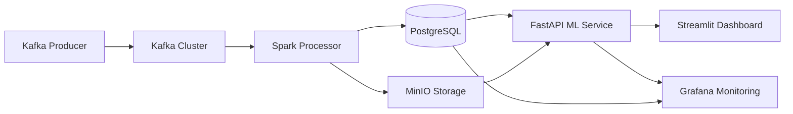

# 🚀 Proyecto Nitro - Sistema de Monitoreo Predictivo Industrial

## 📋 Tabla de Contenidos
1. [Características](#-características)
2. [Arquitectura del Sistema](#-arquitectura-del-sistema)
3. [Servicios y Puertos](#-servicios-y-puertos)
4. [Quick Start](#-quick-start)
5. [Estructura del Proyecto](#-estructura-del-proyecto)
6. [Notebooks de Análisis](#-notebooks-de-análisis)
7. [Flujo de Datos](#-flujo-de-datos)
8. [Tecnologías Implementadas](#-tecnologías-implementadas)
9. [Mantenimiento](#-mantenimiento)
10. [Troubleshooting](#-troubleshooting)

## ✨ Características

- 📊 **Ingesta de datos en tiempo real** con Kafka Producer
- ⚡ **Procesamiento distribuido** con Spark Streaming
- 🔧 **Orquestación inteligente** con Apache Airflow
- 💾 **Almacenamiento escalable** en PostgreSQL y MinIO
- 🤖 **MLOps avanzado** con MLflow y SHAP
- 📈 **Visualización profesional** con Streamlit y Grafana
- 📓 **Análisis exhaustivo** con notebooks especializados
- 🔍 **Monitoreo en tiempo real** con dashboards interactivos

## 🏗️ Arquitectura del Sistema



## 🌐 Servicios y Puertos

| Servicio | URL | Puerto | Credenciales | Estado |
|----------|-----|--------|--------------|--------|
| 🔧 **Airflow** | http://localhost:8080 | 8080 | admin/admin | ✅ Operativo |
| ⚡ **Spark Master** | http://localhost:8081 | 8081 | - | ✅ Operativo |
| 📊 **Streamlit Dashboard** | http://localhost:8501 | 8501 | - | ✅ Operativo |
| 📈 **Grafana** | http://localhost:3000 | 3000 | admin/admin123 | ✅ Operativo |
| 💾 **MinIO Console** | http://localhost:9001 | 9001 | admin/admin12345 | ✅ Operativo |
| 🗄️ **PostgreSQL** | localhost:5432 | 5432 | nitro_user/nitro_pass | ✅ Operativo |
| 🚀 **FastAPI** | http://localhost:8000 | 8000 | - | ✅ Operativo |
| 📡 **Kafka** | localhost:9092 | 9092/29092 | - | ✅ Operativo |

## 🚀 Quick Start

```bash
# Clonar el repositorio
git clone <tu-repositorio>
cd proyecto-nitro

# Iniciar todos los servicios
docker-compose up -d

# Verificar el estado de los servicios
docker-compose ps

# Iniciar el productor de datos
./start-producer.sh

# Acceder a los dashboards (esperar 2-3 minutos para inicialización completa)
echo "Accesos:"
echo "Airflow: http://localhost:8080"
echo "Grafana: http://localhost:3000"
echo "Streamlit: http://localhost:8501"
```

## 📁 Estructura del Proyecto

```
proyecto-nitro/
├── 📊 airflow/                 # DAGs y configuración de Airflow
├── 🚀 api-dashboard/           # FastAPI y Streamlit
│   ├── fastapi/               # API de predicciones ML
│   └── dashboards/            # Dashboards interactivos
├── 📡 kafka-producer/          # Productor de datos Kafka
│   ├── Dockerfile
│   ├── kafka_producer.py
│   └── requirements.txt
├── 🗄️ minio-setup/             # Configuración de buckets MinIO
├── 📓 notebooks/              # Análisis y modelado
│   ├── 📊 EDA.ipynb
│   ├── ⚙️ feature_engineering.ipynb
│   ├── 🤖 model_training.ipynb
│   ├── 🔍 mlflow_tracking.ipynb
│   ├── 📈 SHAP_analysis.ipynb
│   ├── 📋 reports/
│   ├── 🧠 models/
│   └── 💾 data/
│       └── enhanced_predictions.csv
├── 🗃️ postgres-setup/          # Esquemas y config de PostgreSQL
├── ⚡ python-processor/        # Procesador de datos Spark
├── 🔥 spark-processing/       # Jobs de Spark
├── 🐳 docker-compose.yml      # Orquestación de contenedores
├── 🚀 start-producer.sh       # Script de inicio
└── 📖 README.md              # Este archivo
```

## 📓 Notebooks de Análisis

| Notebook | Descripción | Tecnologías |
|----------|-------------|-------------|
| 📊 `EDA.ipynb` | Análisis exploratorio de datos | Pandas, Matplotlib, Seaborn |
| ⚙️ `feature_engineering.ipynb` | Ingeniería de características | Scikit-learn, Featuretools |
| 🤖 `model_training.ipynb` | Entrenamiento de modelos predictivos | Scikit-learn, XGBoost, MLflow |
| 🔍 `mlflow_tracking.ipynb` | Seguimiento de experimentos ML | MLflow, Hyperopt |
| 📈 `SHAP_analysis.ipynb` | Explicabilidad de modelos | SHAP, Matplotlib |

## 🔄 Flujo de Datos

1. **Ingesta**: Kafka Producer genera datos simulados de sensores industriales
2. **Streaming**: Kafka publica en el topic `sensor_topic` con 1 partición
3. **Procesamiento**: Spark procesa los datos en tiempo real con transformations
4. **Almacenamiento**: Datos persistidos en PostgreSQL (estructurado) y MinIO (raw)
5. **Análisis**: Notebooks especializados para EDA y modelado predictivo
6. **Visualización**: Dashboards en tiempo real con Streamlit y Grafana
7. **Predicción**: FastAPI sirve modelos ML para mantenimiento predictivo

## 🛠️ Tecnologías Implementadas

### 🏗️ Data Engineering


### 🤖 Machine Learning


### 📊 Visualización & Monitoring


### 🐳 Infraestructura


## 🛠️ Mantenimiento

### Comandos Útiles
```bash
# Ver logs de todos los servicios
docker-compose logs

# Ver logs específicos de un servicio
docker-compose logs kafka
docker-compose logs spark-master

# Reiniciar un servicio específico
docker-compose restart kafka-producer

# Ver estado de los contenedores
docker-compose ps

# Acceder a PostgreSQL
docker-compose exec postgres psql -U nitro_user -d nitro_db

# Listar topics de Kafka
docker-compose exec kafka kafka-topics --list --bootstrap-server localhost:9092

# Escalar workers de Spark
docker-compose up -d --scale spark-worker=3
```

## 🐛 Troubleshooting

### Problemas Comunes y Soluciones

| Problema | Solución |
|----------|----------|
| Kafka no inicia | Verificar que Zookeeper esté saludable: `docker-compose logs zookeeper` |
| Producer no conecta | Esperar 30-60 segundos para inicialización completa de Kafka |
| PostgreSQL connection refused | Verificar logs: `docker-compose logs postgres` |
| Dashboards no cargan | Esperar 2-3 minutos y verificar que todos los servicios estén UP |
| Airflow webserver error | Ejecutar: `docker-compose restart airflow` |

### Limpieza y Reinstalación
```bash
# Detener y eliminar todos los contenedores y volúmenes
docker-compose down -v

# Reconstruir e iniciar todos los servicios
docker-compose up -d --build

# Forzar recreación de contenedores
docker-compose up -d --force-recreate
```

## 📊 Dashboard de Grafana - Configuración Recomendada

Para configurar Grafana con tus datos de PostgreSQL:

1. Accede a http://localhost:3000
2. Configura la fuente de datos PostgreSQL:
   - Host: `postgres:5432`
   - Database: `nitro_db`
   - User: `nitro_user`
   - Password: `nitro_pass`
3. Importa dashboards para:
   - Monitoring de Kafka (lag, throughput)
   - Métricas de rendimiento de Spark
   - Análisis de predicciones del modelo ML
   - Estado de salud de sensores en tiempo real

## 📝 Licencia

MIT License - ver archivo LICENSE para detalles.

## 🤝 Contribución

¡Las contribuciones son bienvenidas! 

```bash
# 1. Haz fork del proyecto
# 2. Crea tu feature branch
git checkout -b feature/AmazingFeature

# 3. Commit tus cambios
git commit -m 'Add some AmazingFeature'

# 4. Push al branch
git push origin feature/AmazingFeature

# 5. Abre un Pull Request
```

## 📞 Soporte

Si encuentras problemas:
1. Revisa la sección de Troubleshooting
2. Verifica los logs con `docker-compose logs [servicio]`
3. Abre un issue en el repositorio con:
   - Descripción detallada del problema
   - Comandos ejecutados
   - Logs relevantes
   - Capturas de pantalla (si aplica)

---

⭐ **¡Si este proyecto te resulta útil, por favor dale una estrella en GitHub!**


